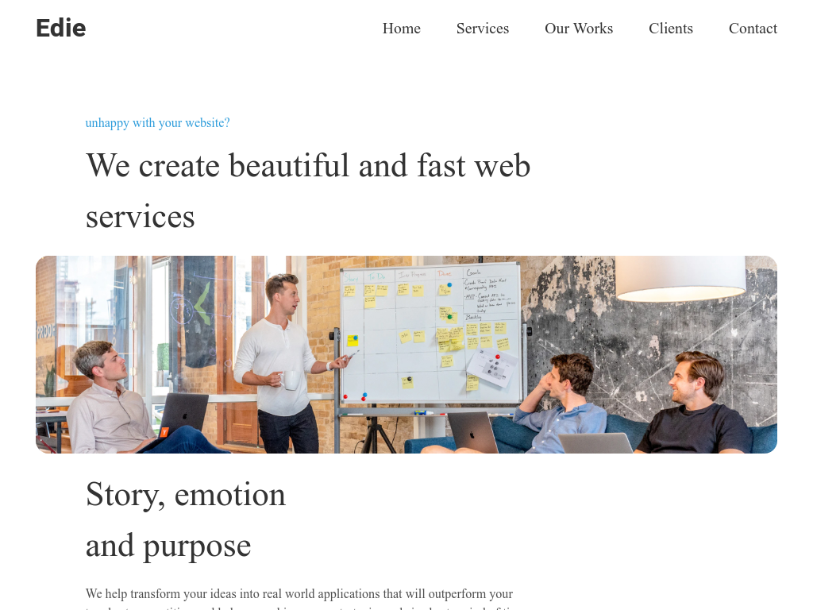

<h1 align="center">Edie Homepage</h1>

   Solution for a challenge from  <a href="http://devchallenges.io" target="_blank">Devchallenges.io</a>.

  <h3>
    <a href="https://edie-homepage.onrender.com/">
      Demo
    </a>
     | 
    <a href="https://devchallenges.io/solutions/vMSNY71y30u2SkkgjoUM">
      Solution
    </a>
     | 
    <a href="https://devchallenges.io/challenges/xobQBuf8zWWmiYMIAZe0">
      Challenge
    </a>
  </h3>

<!-- TABLE OF CONTENTS -->

## Table of Contents

-   [Overview](#overview)
    -   [Built With](#built-with)
-   [Features](#features)
-   [Contact](#contact)

<!-- OVERVIEW -->

## Overview

-   7th challange for resposive web developer path

### Built With

-   [HTML5](https://developer.mozilla.org/en-US/docs/Web/Guide/HTML/HTML5)
-   [CSS](https://developer.mozilla.org/en-US/docs/Web/CSS)
-   [SASS](https://sass-lang.com/)

## Features

This application/site was created as a submission to a [DevChallenges](https://devchallenges.io/challenges) challenge. The challenge was to build an application to complete the given user stories.

## Contact

-   GitHub : [@nggar](https://github.com/nggar)
-   Gmail : jihandokoengg@gmail.com
